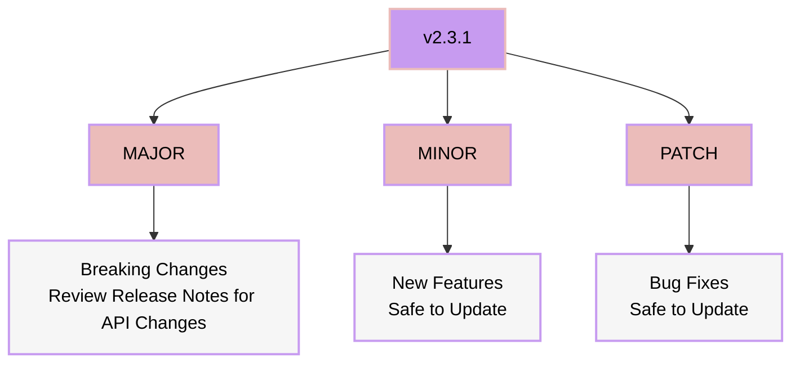

# Hydenix Template

Welcome to the Hydenix template!

This template is designed to help you get started with Hydenix. It includes a basic configuration for Hydenix and some common modules.

If you just templated this flake, you can follow these steps to get started:

1. edit `configuration.nix` with your preferences for hydenix
   - options needing to be changed are marked with `! EDIT`
   - (optional) in your template flake folder, review both `./configuration.nix` and `./modules/hm/default.nix` for more options
2. run `sudo nixos-generate-config --show-hardware-config > hardware-configuration.nix`
3. `git init && git add .` (flakes have to be managed via git)
4. run any of the packages in your new `flake.nix`
    - for rebuild, use `sudo nixos-rebuild switch --flake .`
5. DON'T FORGET: change your password for all users with `passwd` from initialPassword set in `configuration.nix`

NOTE: After launching hydenix, you can run `hyde-shell reload` to generate cache for remaining themes if you want.

All module options are documented [here](https://github.com/richen604/hydenix/blob/main/docs/faq.md#What-are-the-module-options).

Other than that, this is your own nixos configuration. You can do whatever you want with it.
Add modules, change packages, add flakes, even disable hydenix and try something else!

If you have any questions, please refer to the [FAQ](https://github.com/richen604/hydenix/blob/main/docs/faq.md) or [Hydenix README](https://github.com/richen604/hydenix/blob/main/README.md).

You can also reach out to me on the [Hyde Discord](https://discord.gg/AYbJ9MJez7) or [Hydenix GitHub Discussions](https://github.com/richen604/hydenix/discussions).

## Upgrading

Hydenix can be upgraded, downgraded, or version locked easy.
in your template flake folder, update hydenix to main using

```bash
nix flake update hydenix
```

or define a specific version in your `flake.nix` template

```nix
inputs = {
    nixpkgs.url = "github:nixos/nixpkgs/nixos-unstable";
    hydenix = {
      # Available inputs:
      # Main: github:richen604/hydenix
      # Dev: github:richen604/hydenix/dev 
      # Commit: github:richen604/hydenix/<commit-hash>
      # Version: github:richen604/hydenix/v1.0.0
      url = "github:richen604/hydenix";
    };
  };
```

run `nix flake update hydenix` again to load the update, then rebuild your system to apply the changes

## When to Upgrade



- **Always review [release notes](https://github.com/richen604/hydenix/releases) for major updates (API changes)**
- Keep up with patches for stability
- Update to minor versions for new features
  